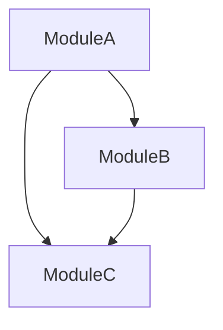

# Skill Builder Examples

Real-world examples of creating skills for different purposes.

## Example 1: Creating a TODO Finder Skill

### User Request
"Create a skill to find all TODO comments in my code"

### Skill Builder Process

**Questions Asked**:
1. What should it do? → Find TODO, FIXME, HACK comments
2. When should it activate? → "find todos", "show todos", "check fixmes"
3. What tools needed? → Read, Grep (search only)
4. What output? → Report organized by priority and file

**Generated Skill**:

```yaml
---
name: todo-finder
description: Find TODO, FIXME, HACK, and NOTE comments in codebase. Lists by priority, file, and assignee. Use when you need to "find todos", "show todos", "check todos", "list fixmes", or reviewing code comments.
allowed-tools: Read, Grep, Glob
---

# TODO Finder

Find and organize all code comments that need action.

## When to Activate
- "find todos"
- "show todos"
- "check fixmes"
- "list todos"

## Process

### Step 1: Search Comments
Use Grep to find:
- `// TODO:` or `# TODO:`
- `// FIXME:` or `# FIXME:`
- `// HACK:` or `# HACK:`
- `// NOTE:` or `# NOTE:`

### Step 2: Parse Details
Extract:
- Priority: [HIGH], [MEDIUM], [LOW]
- Assignee: @username
- Description
- File and line number

### Step 3: Generate Report
Group by:
1. Priority (high → low)
2. Type (FIXME → TODO → NOTE)
3. File/module

## Output Format
[Report template showing organized TODOs]
```

**Test Phrases**:
- "Find all todos in the project"
- "Show me fixme comments"
- "List todos by priority"

---

## Example 2: Creating a Component Generator

### User Request
"I need a skill to generate React components with TypeScript"

### Skill Builder Process

**Questions Asked**:
1. What should it do? → Generate React component boilerplate
2. When? → "create component", "generate component", "new component"
3. Tools? → Read (check conflicts), Write (create files)
4. Output? → Component file, test file, style file

**Generated Skill**:

```yaml
---
name: react-component-generator
description: Generate React components with TypeScript, tests, and styles. Creates .tsx component, .test.tsx, and .module.css files. Use when you need to "create component", "generate component", "new component", or scaffolding React components.
allowed-tools: Read, Write, Glob
---

# React Component Generator

Generate type-safe React components with tests and styles.

## When to Activate
- "create component"
- "generate component"
- "new react component"
- "scaffold component"

## Generation Process

### Step 1: Get Requirements
Ask user:
- Component name (PascalCase)
- Type: functional/class
- Props interface
- Location

### Step 2: Validate
Check:
- Name is valid
- No existing component with same name
- Directory exists

### Step 3: Generate Files

Create:
```
components/
  ComponentName/
    ├── ComponentName.tsx
    ├── ComponentName.test.tsx
    ├── ComponentName.module.css
    └── index.ts
```

## Templates

### Component Template
```typescript
interface ComponentNameProps {
  // Props here
}

export const ComponentName: React.FC<ComponentNameProps> = (props) => {
  return (
    <div className={styles.container}>
      {/* Component content */}
    </div>
  );
};
```

### Test Template
```typescript
describe('ComponentName', () => {
  it('renders without crashing', () => {
    // Test code
  });
});
```

## Output
Shows created files and next steps
```

**Test Phrases**:
- "Create a Button component"
- "Generate a new UserCard component"
- "Scaffold a LoginForm component"

---

## Example 3: Creating a Performance Checker

### User Request
"Make a skill that checks for performance issues in my iOS app"

### Skill Builder Process

**Questions Asked**:
1. What should it do? → Find common performance issues
2. When? → "check performance", "performance issues", "slow code"
3. Tools? → Read, Grep, Bash (to run profiling)
4. Output? → Report with issues and suggestions

**Generated Skill**:

```yaml
---
name: ios-performance-check
description: Find iOS performance issues like main thread blocking, heavy operations, memory leaks, and N+1 queries. Use when app is slow, checking performance, or mentions "performance issues", "slow code", or profiling iOS apps.
allowed-tools: Read, Grep, Glob, Bash
---

# iOS Performance Checker

Identify common performance bottlenecks in iOS code.

## When to Activate
- "check performance"
- "performance issues"
- "app is slow"
- "find bottlenecks"
- "profile code"

## Performance Checks

### 1. Main Thread Blocking
Find:
- Network calls on main thread
- Heavy computation on main thread
- Synchronous file I/O

Pattern: Operations without background queue

### 2. Memory Issues
Find:
- Retain cycles
- Large image loading
- Unbounded collections
- Missing dispose

### 3. Database Performance
Find:
- N+1 queries
- Missing indexes
- Inefficient queries
- Large result sets

### 4. UI Performance
Find:
- Complex view hierarchies
- Missing cell reuse
- Heavy layoutSubviews
- Expensive drawing

## Analysis Process

### Step 1: Scan Code
Use Grep to find patterns

### Step 2: Analyze Severity
Rate each issue:
- Critical: Causes visible lag
- High: Noticeable impact
- Medium: Could be optimized
- Low: Minor improvement

### Step 3: Generate Report
Show issues with fixes

## Output Format
```markdown
# iOS Performance Report

## Summary
- Critical issues: X
- High priority: X
- Estimated impact: [description]

## Critical Issues

### Main Thread Blocking
**File**: `ViewController.swift:45`
**Issue**: Network call on main thread

**Current**:
```swift
let data = try Data(contentsOf: url) // Blocks UI!
```

**Fix**:
```swift
URLSession.shared.dataTask(with: url) { data, _, _ in
    DispatchQueue.main.async {
        // Update UI
    }
}.resume()
```

**Impact**: UI freezes during network request
```
```

**Test Phrases**:
- "Check performance in my app"
- "Find performance bottlenecks"
- "Why is my app slow?"

---

## Example 4: Creating a Migration Helper

### User Request
"Create a skill to help migrate from RxSwift 5 to RxSwift 6"

### Skill Builder Process

**Questions Asked**:
1. What should it do? → Identify deprecated APIs, suggest replacements
2. When? → "migrate rxswift", "upgrade rxswift", deprecated warnings
3. Tools? → Read, Write (to fix), Grep (to find)
4. Output? → List of changes needed + option to auto-fix

**Generated Skill**:

```yaml
---
name: rxswift-migration
description: Migrate code from RxSwift 5 to RxSwift 6. Identifies deprecated APIs and suggests modern alternatives. Use when upgrading RxSwift, seeing deprecation warnings, or need to "migrate rxswift", "upgrade rxswift", or "fix deprecated".
allowed-tools: Read, Write, Grep, Glob
---

# RxSwift Migration Helper

Upgrade from RxSwift 5 to RxSwift 6 with deprecated API fixes.

## When to Activate
- "migrate rxswift"
- "upgrade rxswift"
- "rxswift 6"
- "fix deprecated"
- "rxswift deprecation"

## Migration Checks

### 1. Variable/Driver Changes
**Deprecated**: `Variable<T>`
**Replace with**: `BehaviorRelay<T>`

### 2. Subject Changes
**Deprecated**: `BehaviorSubject<T>`
**Replace with**: `BehaviorRelay<T>` (for most cases)

### 3. Operator Changes
Find and replace deprecated operators

## Migration Process

### Step 1: Scan for Deprecated
Use Grep to find:
- `Variable<`
- `.asDriver(onErrorJustReturn:`
- Other deprecated patterns

### Step 2: Analyze Impact
Check:
- How many instances
- Complexity of replacement
- Test coverage

### Step 3: Propose Changes
Show:
- Current usage
- Replacement code
- Why it changed

### Step 4: Apply (if approved)
Automatically update code

## Common Migrations

### Migration 1: Variable → BehaviorRelay

**Before**:
```swift
let count = Variable<Int>(0)
count.value = 5
count.asObservable()
```

**After**:
```swift
let count = BehaviorRelay<Int>(value: 0)
count.accept(5)
count.asObservable()
```

### Migration 2: ShareReplay

**Before**:
```swift
.shareReplay(1)
```

**After**:
```swift
.share(replay: 1, scope: .whileConnected)
```

## Output Format
```markdown
# RxSwift Migration Report

## Summary
- Deprecated usages: X
- Auto-fixable: X
- Manual review needed: X

## Changes Needed

### Variable → BehaviorRelay (Auto-fixable)
Found X instances:
- `PaymentViewModel.swift:23`
- `StoresViewModel.swift:45`

**Action**: Replace `Variable` with `BehaviorRelay`

### ShareReplay Update (Auto-fixable)
Found X instances:
- `NetworkService.swift:67`

**Action**: Update shareReplay syntax

## Manual Review Required

### Custom Operators
File: `Extensions.swift:89`
**Reason**: Uses deprecated operator with custom logic
**Suggestion**: [Migration guide]

## Next Steps
1. Review proposed changes
2. Run auto-fix (Y/N)?
3. Update tests
4. Verify compilation
```
```

**Test Phrases**:
- "Migrate my RxSwift code to version 6"
- "Fix RxSwift deprecations"
- "Upgrade to RxSwift 6"

---

## Example 5: Creating a Dependency Visualizer

### User Request
"I want a skill that shows me the dependency graph of my modules"

### Skill Builder Process

**Questions Asked**:
1. What should it do? → Map dependencies between modules
2. When? → "show dependencies", "dependency graph", "module dependencies"
3. Tools? → Read, Grep (to find imports), Bash (for graphing)
4. Output? → Visual graph + text report

**Generated Skill**:

```yaml
---
name: dependency-visualizer
description: Map and visualize module dependencies in the codebase. Shows import relationships and identifies circular dependencies. Use when need to "show dependencies", "dependency graph", "module dependencies", or investigating architecture.
allowed-tools: Read, Grep, Glob, Bash
---

# Dependency Visualizer

Map and visualize module dependencies.

## When to Activate
- "show dependencies"
- "dependency graph"
- "module dependencies"
- "check imports"
- "circular dependencies"

## Analysis Process

### Step 1: Scan Imports
Use Grep to find:
- `import X`
- `#include "X"`
- `require('X')`
- `from X import`

### Step 2: Build Graph
Create map:
```
ModuleA → [ModuleB, ModuleC]
ModuleB → [ModuleC]
ModuleC → []
```

### Step 3: Detect Issues
Find:
- Circular dependencies
- Unused modules
- Heavy dependencies
- Bidirectional imports

### Step 4: Visualize
Generate:
- ASCII graph
- Mermaid diagram
- Dependency list

## Output Format
```markdown
# Dependency Graph

## Overview
- Total modules: X
- Total dependencies: X
- Circular dependencies: X
- Max depth: X

## Visual Graph



## Detailed Dependencies

### ModuleA
**Imports**:
- ModuleB (direct)
- ModuleC (direct)

**Imported by**:
- AppDelegate

**Depth**: 2

### Issues Found

#### Circular Dependency
**Modules**: ModuleA ↔ ModuleB
**Files**:
- `ModuleA/File1.swift` imports `ModuleB`
- `ModuleB/File2.swift` imports `ModuleA`

**Suggestion**: Extract shared code to ModuleC

## Recommendations
1. Break circular dependency between ModuleA and ModuleB
2. Consider splitting ModuleX (too many dependencies)
3. ModuleY appears unused, consider removing
```
```

**Test Phrases**:
- "Show me the dependency graph"
- "What modules depend on Authentication?"
- "Check for circular dependencies"

---

## Tips for Building Your Own Skills

### Start Simple
Begin with a basic version, then enhance:
1. Core functionality first
2. Add error handling
3. Add advanced features
4. Add customization options

### Be Specific in Descriptions
Compare:
- ❌ "Helps with code"
- ✅ "Find unused variables in TypeScript files. Use when refactoring or mentions 'unused variables', 'dead code'"

### Test Thoroughly
Try different trigger phrases:
- Direct: "use the [skill-name] skill"
- Natural: "[do the thing the skill does]"
- Implicit: "[mention keywords from description]"

### Iterate Based on Usage
After creating:
1. Use the skill in real scenarios
2. Note what works/doesn't work
3. Update description with better triggers
4. Add examples from real usage
5. Improve output format

### Share with Team
Once working well:
1. Commit to `.claude/skills/`
2. Document in team README
3. Share example use cases
4. Get feedback
5. Iterate based on team needs
